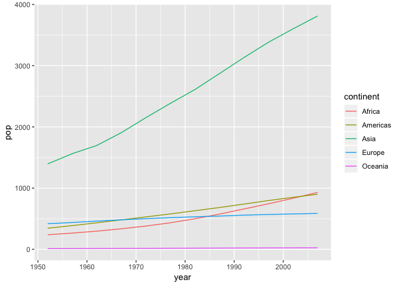
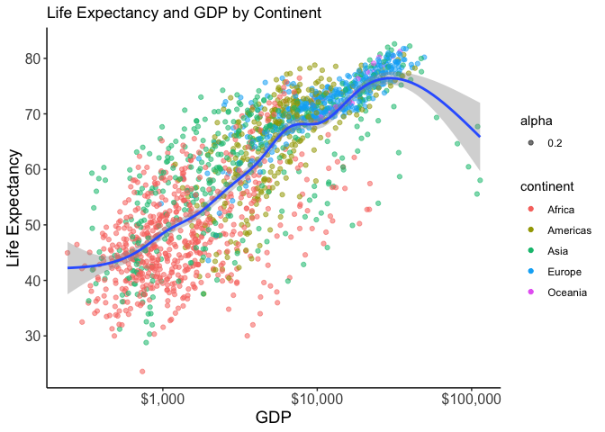

As always, need to load gapminder and tidyverse


```r
suppressPackageStartupMessages(library(tidyverse))
suppressPackageStartupMessages(library(gapminder))
suppressPackageStartupMessages(library(forcats))
library(scales)
```

```
## 
## Attaching package: 'scales'
```

```
## The following object is masked from 'package:purrr':
## 
##     discard
```

```
## The following object is masked from 'package:readr':
## 
##     col_factor
```

```r
library(plotly)
```

```
## 
## Attaching package: 'plotly'
```

```
## The following object is masked from 'package:ggplot2':
## 
##     last_plot
```

```
## The following object is masked from 'package:stats':
## 
##     filter
```

```
## The following object is masked from 'package:graphics':
## 
##     layout
```

*Part 1 of the assignment - Factor management*

Elaboration for the gapminder data set:
First, filter the Gapminder data to remove observations associated with the continent of Oceania. In order to get a comparison of the structure before tinkering around with gapminder, I will look at the structure of gapminder and the factorness of gapminder$continent


```r
str(gapminder)
```

```
## Classes 'tbl_df', 'tbl' and 'data.frame':	1704 obs. of  6 variables:
##  $ country  : Factor w/ 142 levels "Afghanistan",..: 1 1 1 1 1 1 1 1 1 1 ...
##  $ continent: Factor w/ 5 levels "Africa","Americas",..: 3 3 3 3 3 3 3 3 3 3 ...
##  $ year     : int  1952 1957 1962 1967 1972 1977 1982 1987 1992 1997 ...
##  $ lifeExp  : num  28.8 30.3 32 34 36.1 ...
##  $ pop      : int  8425333 9240934 10267083 11537966 13079460 14880372 12881816 13867957 16317921 22227415 ...
##  $ gdpPercap: num  779 821 853 836 740 ...
```

```r
str(gapminder$continent)
```

```
##  Factor w/ 5 levels "Africa","Americas",..: 3 3 3 3 3 3 3 3 3 3 ...
```

```r
levels(gapminder$continent)
```

```
## [1] "Africa"   "Americas" "Asia"     "Europe"   "Oceania"
```

```r
nlevels(gapminder$continent)
```

```
## [1] 5
```

```r
class(gapminder$continent)
```

```
## [1] "factor"
```


```r
forcats::fct_count(gapminder$continent)
```

```
## # A tibble: 5 x 2
##   f            n
##   <fct>    <int>
## 1 Africa     624
## 2 Americas   300
## 3 Asia       396
## 4 Europe     360
## 5 Oceania     24
```
The other way to do this is using dplyr:


```r
gapminder %>% 
  count(continent)
```

```
## # A tibble: 5 x 2
##   continent     n
##   <fct>     <int>
## 1 Africa      624
## 2 Americas    300
## 3 Asia        396
## 4 Europe      360
## 5 Oceania      24
```


```r
no_oceania <- gapminder %>%
  filter(continent!="Oceania")

str(no_oceania)
```

```
## Classes 'tbl_df', 'tbl' and 'data.frame':	1680 obs. of  6 variables:
##  $ country  : Factor w/ 142 levels "Afghanistan",..: 1 1 1 1 1 1 1 1 1 1 ...
##  $ continent: Factor w/ 5 levels "Africa","Americas",..: 3 3 3 3 3 3 3 3 3 3 ...
##  $ year     : int  1952 1957 1962 1967 1972 1977 1982 1987 1992 1997 ...
##  $ lifeExp  : num  28.8 30.3 32 34 36.1 ...
##  $ pop      : int  8425333 9240934 10267083 11537966 13079460 14880372 12881816 13867957 16317921 22227415 ...
##  $ gdpPercap: num  779 821 853 836 740 ...
```

```r
#after I filtered out Oceania, there are only 1680 rows compared to 1704 with Oceania not filtered, however the structure function tells me that continent is a factor with 5 levels as before.
```


```r
levels(gapminder$continent)
```

```
## [1] "Africa"   "Americas" "Asia"     "Europe"   "Oceania"
```

```r
#I still have Oceania as a level using the method above
```

Because I still have Oceania as a level using the filter method, I will now try using the forcats_drop way. 


```r
no_oceania$continent %>% 
  fct_drop() %>% 
  levels()
```

```
## [1] "Africa"   "Americas" "Asia"     "Europe"
```

```r
no_oceania
```

```
## # A tibble: 1,680 x 6
##    country     continent  year lifeExp      pop gdpPercap
##    <fct>       <fct>     <int>   <dbl>    <int>     <dbl>
##  1 Afghanistan Asia       1952    28.8  8425333      779.
##  2 Afghanistan Asia       1957    30.3  9240934      821.
##  3 Afghanistan Asia       1962    32.0 10267083      853.
##  4 Afghanistan Asia       1967    34.0 11537966      836.
##  5 Afghanistan Asia       1972    36.1 13079460      740.
##  6 Afghanistan Asia       1977    38.4 14880372      786.
##  7 Afghanistan Asia       1982    39.9 12881816      978.
##  8 Afghanistan Asia       1987    40.8 13867957      852.
##  9 Afghanistan Asia       1992    41.7 16317921      649.
## 10 Afghanistan Asia       1997    41.8 22227415      635.
## # ... with 1,670 more rows
```

```r
#Oceania is now removed as a factor level. After dropping Oceania, I have 1,680 rows whereas before I had 1704, so that's a sanity check to see that it worked.
```

Now I will re-order the continents based on aggregate population of each continent from smallest to largest


```r
fct_reorder(gapminder$continent, gapminder$pop, max) %>% 
  levels() %>% 
  head()
```

```
## [1] "Oceania"  "Europe"   "Africa"   "Americas" "Asia"
```

Backwards re-order, from largest population to smallest:


```r
fct_reorder(gapminder$continent, gapminder$pop, max, .desc = TRUE) %>% 
  levels() %>% 
  head() 
```

```
## [1] "Asia"     "Americas" "Africa"   "Europe"   "Oceania"
```

To verify that Asia is the most populous continent and Oceania is the least populous, I plotted the population of each continent by year. Africa and Americas are neck in neck for being second most populous.


```r
gapminder %>% 
  mutate(pop = pop/1000000) %>% 
  group_by(continent, year) %>% 
  summarize(pop = sum(pop)) %>% 
  ggplot(aes(year, pop)) +
  geom_line(aes(color=continent))
```

<!-- -->


 
#Part 2 File I/O

I first filtered the gapminder data so that I only have the Americas data for year 2007 and named that Amer_gap.


```r
Amer_gap <- gapminder %>%
  filter(year == 2007, continent == "Americas")

str(Amer_gap) 
```

```
## Classes 'tbl_df', 'tbl' and 'data.frame':	25 obs. of  6 variables:
##  $ country  : Factor w/ 142 levels "Afghanistan",..: 5 12 15 21 24 26 30 33 37 38 ...
##  $ continent: Factor w/ 5 levels "Africa","Americas",..: 2 2 2 2 2 2 2 2 2 2 ...
##  $ year     : int  2007 2007 2007 2007 2007 2007 2007 2007 2007 2007 ...
##  $ lifeExp  : num  75.3 65.6 72.4 80.7 78.6 ...
##  $ pop      : int  40301927 9119152 190010647 33390141 16284741 44227550 4133884 11416987 9319622 13755680 ...
##  $ gdpPercap: num  12779 3822 9066 36319 13172 ...
```

```r
head(Amer_gap)
```

```
## # A tibble: 6 x 6
##   country   continent  year lifeExp       pop gdpPercap
##   <fct>     <fct>     <int>   <dbl>     <int>     <dbl>
## 1 Argentina Americas   2007    75.3  40301927    12779.
## 2 Bolivia   Americas   2007    65.6   9119152     3822.
## 3 Brazil    Americas   2007    72.4 190010647     9066.
## 4 Canada    Americas   2007    80.7  33390141    36319.
## 5 Chile     Americas   2007    78.6  16284741    13172.
## 6 Colombia  Americas   2007    72.9  44227550     7007.
```


```r
write_csv(Amer_gap, "Amer_gap.csv")
```

Then I re-opened the CSV file and see that country and continent has turned into a character vector when it was a factor before. 


```r
read_csv("Amer_gap.csv")
```

```
## Parsed with column specification:
## cols(
##   country = col_character(),
##   continent = col_character(),
##   year = col_integer(),
##   lifeExp = col_double(),
##   pop = col_integer(),
##   gdpPercap = col_double()
## )
```

```
## # A tibble: 25 x 6
##    country            continent  year lifeExp       pop gdpPercap
##    <chr>              <chr>     <int>   <dbl>     <int>     <dbl>
##  1 Argentina          Americas   2007    75.3  40301927    12779.
##  2 Bolivia            Americas   2007    65.6   9119152     3822.
##  3 Brazil             Americas   2007    72.4 190010647     9066.
##  4 Canada             Americas   2007    80.7  33390141    36319.
##  5 Chile              Americas   2007    78.6  16284741    13172.
##  6 Colombia           Americas   2007    72.9  44227550     7007.
##  7 Costa Rica         Americas   2007    78.8   4133884     9645.
##  8 Cuba               Americas   2007    78.3  11416987     8948.
##  9 Dominican Republic Americas   2007    72.2   9319622     6025.
## 10 Ecuador            Americas   2007    75.0  13755680     6873.
## # ... with 15 more rows
```

Now to turn continent back into factor with levels:


#Part 3 Visualization design

*Before*

So starting off with plotting lifeExp and gdpPercap gives me this figure. Overall, from this figure, I can see that life expectancy goes up with gdp but i don't know anything much else about those data points e.g., which continent, population density etc., 

```r
ggplot(gapminder, aes(gdpPercap, lifeExp)) + scale_x_log10() + 
  geom_point() 
```

<!-- -->

*After*

labels=dollar_format()


```r
p <- ggplot(gapminder, aes(gdpPercap, lifeExp)) + 
  scale_x_log10(labels = dollar_format()) + 
  scale_y_continuous(breaks=1:10 * 10, labels = comma_format()) +
  geom_point(aes(color = continent, alpha = .2)) + 
  geom_smooth() +
  labs(x = "GDP",
       y = "Life Expectancy",
       title = "Life Expectancy and GDP by Continent") +
theme_classic() +
theme(axis.text=element_text(size=12),
        axis.title=element_text(size=14))

p
```

```
## `geom_smooth()` using method = 'gam' and formula 'y ~ s(x, bs = "cs")'
```

<!-- -->

```r
#I think this second graph is a more interesting and informative graph. It hasclear labels. It includes a Loess line with standard error. We can where the countries from different continents land in terms of life expectancy and GPD. However, I don't know how to get rid of the alpha on the legend. 
```


##Now I will convert the above ggplot to plotly by first loading plotly


```r
suppressPackageStartupMessages(library(plotly))
```


```r
# p %>% 
 # ggplotly()

#Using plotly has the benefits of being an interactive graph that can tell you information about each data point that you hover over. You can also compare multiple data points using "compare data over hover". You can also zoom in and out to further inspect the data points
```


#Part 4 - Using ggsave 


```r
ggsave("hw05_plot.png", p, scale = 1, width = NA, height = NA, dpi = 600, limitsize = TRUE)
```

```
## Saving 7 x 5 in image
```

```
## `geom_smooth()` using method = 'gam' and formula 'y ~ s(x, bs = "cs")'
```


##Now I will load and embed it into the report. 


